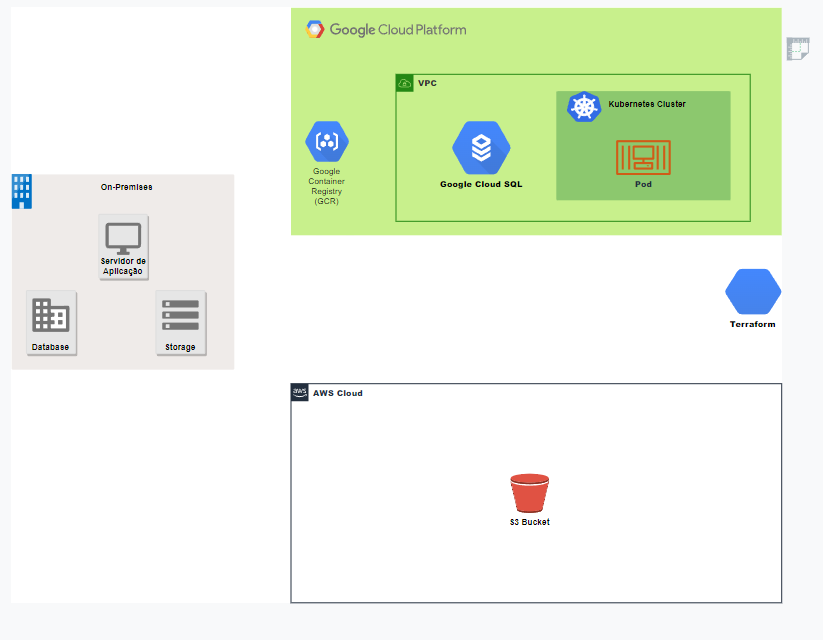

# project-multicloud-Luxxy

## Sobre o projeto

O projeto multicloud Luxxy deriva-se de um rapido bootcamp sobre tecnologias Cloud ministrado por [Jean Rodrigues](https://www.linkedin.com/in/jean-rod/) e sua equipe [thecloudbootcamp](https://thecloudbootcamp.com/pt/). O objetivo do projeto é ajudar uma rede de hotéis ficticios chamada Luxxy a passar pelos desafios que o COVID-23 causou a todo o mundo comercial, acelerando assim sua necessidade de abandonar seus servidores on-premises em prol de uma arquitetura em cloud de confiança e desempenho.

## Desafio a ser superado

A empresa ficticia Luxxy precisou adicionar uma aplicação para registrar os exames de COVID-23 de seus hospedes (apenas assim seria permitida a hospedagem em suas instalações, medida tomada como segurança para os propios hospedes e equipe). Porém a alta demanda de hospedes e uma infraestrutura já datada fizeram com que seus serviços apresenta-sem um alto tempo de espera para respostas, o que não se alinhava com a estrategia de agilidade e qualidade da empresa. Pensando em como solucionar este gargalo a empresa decidiu acelerar seus planos para migrar seu ambiente para Cloud e montou um projeto de migração.

## Definições do projeto

O objetivo principal é migrar o ambiente on-premises (servidores de aplicação, storage e banco de dados) para um ambiente cloud. Para maior segurança o ambiente deve ser montado em multicloud com a Google Cloud Platform (GCP) ficando a cargo da aplicação e banco de  dados e a Amazon Web Services (AWS) para storage.
Abaixo podemos conferir um escopo inicial do projeto.

## Considerações para o projeto

- Todo o modelo on-premises será de responsabilidade da equipe Luxxy (o objetivo deste bootcamp é conhecer mais sobre as tecnologias cloud, por este motivo, tanto a aplicação, banco de dados, arquivos não terão destaque no projeto, seguindo o pré-suposto que alguma equipe providenciou).
- Para criação da infraestrutura cloud será usada a ferramenta Terraform.
- Tanto as contas da GCP quanto da AWS podem ser no modelo Free para este projeto. Recomendo criar uma nova conta em ambas as plataformas para desfrutar dos 90 dias com bonus gratis.

## Etapas do projeto

- [ ] Missão 1 - Provisionar o ambiente cloud com Terraform (IAC)
- [ ] Missão 2 - Efetuar o Deploy da aplicação
- [ ] Missão 3 - Migrar os dados dos servidores on-premises para a cloud
