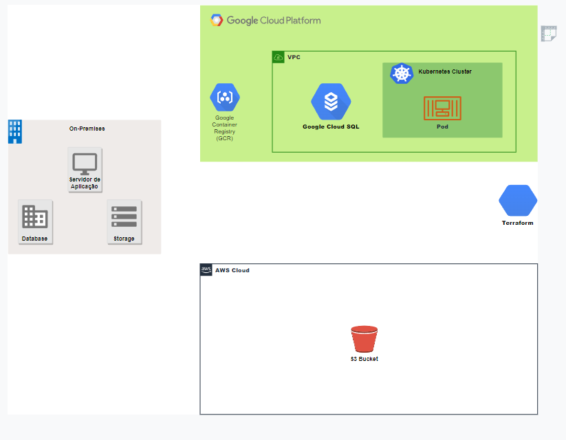
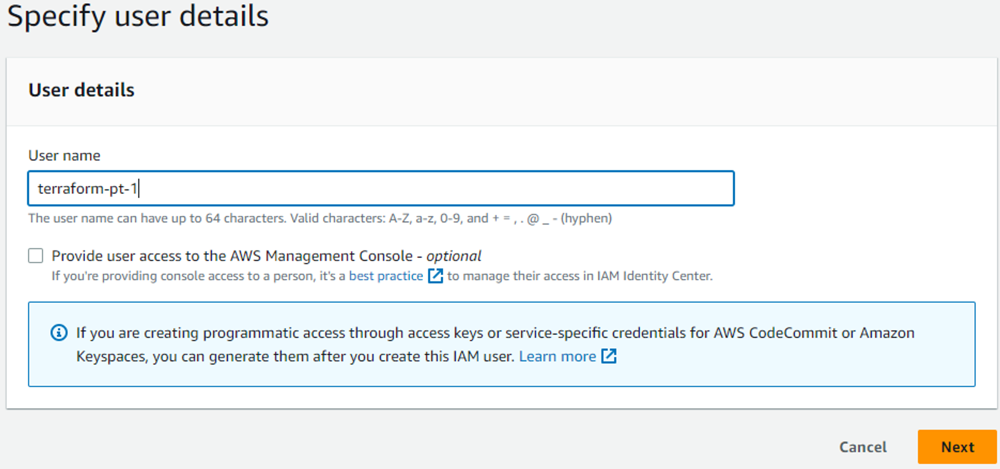
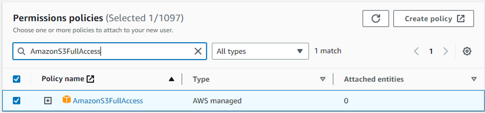
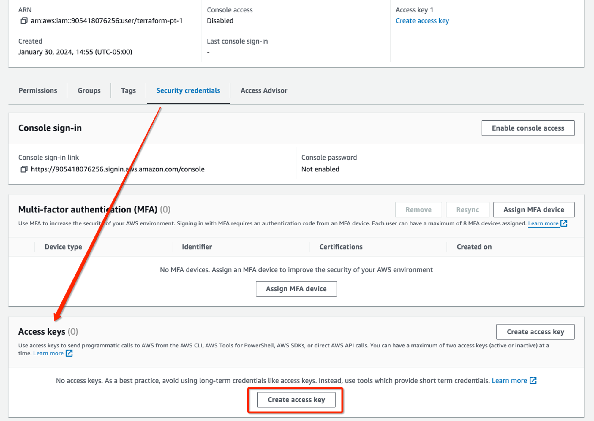
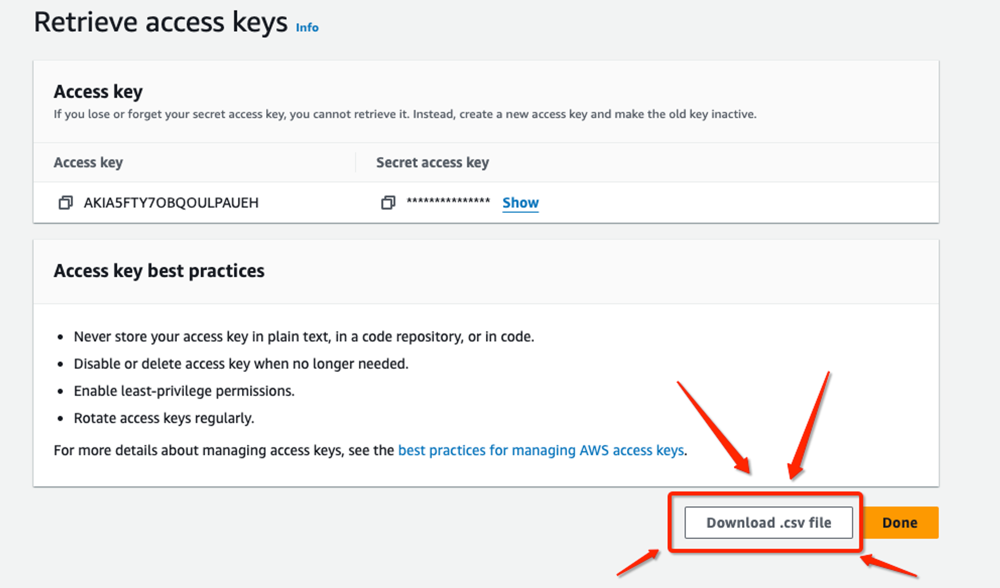
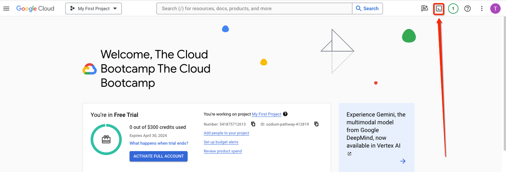
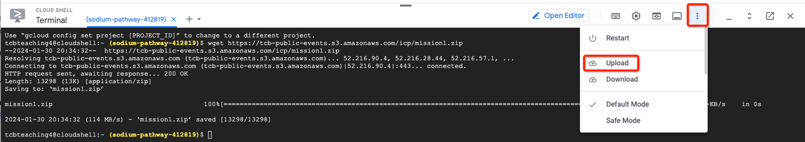
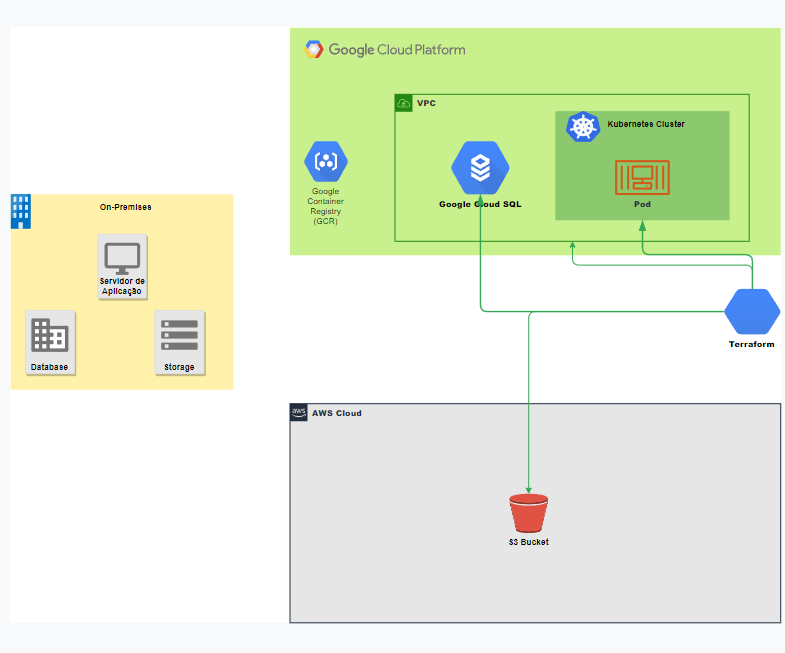

# project-multicloud-Luxxy

## Sobre o projeto

O projeto multicloud Luxxy deriva-se de um rapido bootcamp sobre tecnologias Cloud ministrado por [Jean Rodrigues](https://www.linkedin.com/in/jean-rod/) e sua equipe [thecloudbootcamp](https://thecloudbootcamp.com/pt/). O objetivo do projeto é ajudar uma rede de hotéis ficticios chamada Luxxy a passar pelos desafios que o COVID-23 causou a todo o mundo comercial, acelerando assim sua necessidade de abandonar seus servidores on-premises em prol de uma arquitetura em cloud de confiança e desempenho.

## Desafio a ser superado

A empresa ficticia Luxxy precisou adicionar uma aplicação para registrar os exames de COVID-23 de seus hospedes (apenas assim seria permitida a hospedagem em suas instalações, medida tomada como segurança para os propios hospedes e equipe). Porém a alta demanda de hospedes e uma infraestrutura já datada fizeram com que seus serviços apresenta-sem um alto tempo de espera para respostas, o que não se alinhava com a estrategia de agilidade e qualidade da empresa. Pensando em como solucionar este gargalo a empresa decidiu acelerar seus planos para migrar seu ambiente para Cloud e montou um projeto de migração.

## Definições do projeto

O objetivo principal é migrar o ambiente on-premises (servidores de aplicação, storage e banco de dados) para um ambiente cloud. Para maior segurança o ambiente deve ser montado em multicloud com a Google Cloud Platform (GCP) ficando a cargo da aplicação e banco de  dados e a Amazon Web Services (AWS) para storage.
Abaixo podemos conferir um escopo inicial do projeto.



## Considerações para o projeto

- Todo o modelo on-premises será de responsabilidade da equipe Luxxy (o objetivo deste bootcamp é conhecer mais sobre as tecnologias cloud, por este motivo, tanto a aplicação, banco de dados, arquivos não terão destaque no projeto, seguindo o pré-suposto que alguma equipe providenciou).
- Para criação da infraestrutura cloud será usada a ferramenta Terraform.
- Tanto as contas da GCP quanto da AWS podem ser no modelo Free para este projeto. Recomendo criar uma nova conta em ambas as plataformas para desfrutar dos 90 dias com bonus gratis.

## Etapas do projeto

- [ ] Missão 1 - Provisionar o ambiente cloud com Terraform (IAC)
- [ ] Missão 2 - Efetuar o Deploy da aplicação
- [ ] Missão 3 - Migrar os dados dos servidores on-premises para a cloud

# Missão 1 - Provisionamento

### Criando contas de acesso nos provedores Cloud

- Para criação no Google GCP basta seguir os passos indicados pelo próprio Google na opção *Comece a usar gratuitamente*. [GCP](https://cloud.google.com/).
- Para criação na AWS basta seguir os passos em *Comece a usar gratuitamente*. [AWS](https://aws.amazon.com/pt/)

*Importante ressaltar que será necessario cadastrar um cartão de crédito em ambos os casos. Seguindo a risca as indicações deste projeto, **NENHUM** custo irá ocorrer, pois vamos usar os créditos disponibilizados no periodo de teste.*

## AWS

### Criando um usúario para o Terraform usando IAM

- Logue com sua nova criada. Na barra de pesquisas, digite IAM. Na seção Services, clique em IAM.
- Clique em Users e em seguida Add users, insira o nome **terraform-pt-1** e clique em Next para criar o usuário do tipo programmatic.



- Após avançar, em Set permissions, clique no botão Attach existing policies directly.
- Digite AmazonS3FullAccess em Search.
- Selecione AmazonS3FullAccess



### Criando o a Access Key (Chave de Acesso) para o usuário terraform-pt-1 usando o serviço IAM

- Acesse o usuário terraform-pt-1
- Clique na aba Security credentials
- Navegue até a seção Access keys
- Clique em Create access key



- Selecione Command Line Interface (CLI) e I understand the above recommendation and want to proceed to create an access key.
- Clique em Next.
- Clique em Create access key.
- Clique em Download .csv file
- Após o download finalizar, clique em Done.
- Com o download feito, renomeie o .csv para key.csv



## GCP

### Preparando o ambiente para executar o Terraform

- Acesse a Console da Google Cloud (https://console.cloud.google.com/) e logue com sua nova criada
- Abra o Cloud Shell



- Baixe o arquivo mission1.zip no Google Cloud shell usando o comando wget

```shell
wget https://tcb-public-events.s3.amazonaws.com/icp/mission1.zip
```

- Faça o upload do arquivo key.csv para o Cloud Shell usando o browser



- Verifique se os arquivos mission1.zip e key.csv estão na pasta no Cloud Shell usando o comando abaixo:

```shell
ls -lt
```
- Execute os comandos de preparação dos arquivos:

```shell
unzip mission1.zip
```

```shell
mv key.csv mission1/pt
```

```shell
cd mission1/pt
```

```shell
chmod +x *.sh
```

- Execute os comandos abaixo para preparar o ambiente da AWS e GCP

```shell
mkdir -p ~/.aws/
​
touch ~/.aws/credentials_multiclouddeploy
​
./aws_set_credentials.sh key.csv
​
GOOGLE_CLOUD_PROJECT_ID=$(gcloud config get-value project)
​
gcloud config set project $GOOGLE_CLOUD_PROJECT_ID
```

- Clique em Autorize.
- Execute o comando abaixo para setar o projeto no Google Cloud Shell:

```shell
./gcp_set_project.sh
```

- Execute os comandos para habilitar as APIs do Kubernetes, Container Registry e Cloud SQL

```shell
gcloud services enable containerregistry.googleapis.com
​
gcloud services enable container.googleapis.com
​
gcloud services enable sqladmin.googleapis.com
​
gcloud services enable cloudresourcemanager.googleapis.com
​
gcloud services enable serviceusage.googleapis.com
​
gcloud services enable compute.googleapis.com
​
gcloud services enable servicenetworking.googleapis.com --project=$GOOGLE_CLOUD_PROJECT_ID
```

### Executando o Terraform para provisionar a infraestrutura MultiCloud na AWS e Google Cloud

- Execute os seguintes comandos para provisionar os recursos de infraestrutura:

```shell
cd ~/mission1/pt/terraform/
​
terraform init
​
terraform plan
​
terraform apply
```
*Atenção: O processo de provisionamento pode levar entre 15 a 25 minutos para finalizar. Mantenha o CloudShell aberto durante o processo. Caso seja desconectado, clique em Reconectar quando a sessão expirar (a sessão expira após 5 minutos de inatividade por padrão)*

- Com os passos devidamente efetuados esta terminado a missão 1 do projeto.

## Etapas do projeto

- [X] Missão 1 - Provisionar o ambiente cloud com Terraform (IAC)
- [ ] Missão 2 - Efetuar o Deploy da aplicação
- [ ] Missão 3 - Migrar os dados dos servidores on-premises para a cloud

- Como podemos observar no modelo abaixo o provisionamento do ambiente foi feito pelo TerraForm, ficando a cargo das proximas missões o Deploy da aplicação e migração de dados.


